  <picture>
    <source media="(prefers-color-scheme: dark)" srcset="./assets/banner-dark.svg">
    <source media="(prefers-color-scheme: light)" srcset="./assets/banner-light.svg">
    
  </picture>

  <a href="https://www.linkedin.com/in/nicholas-burgo/">LinkedIn</a>&nbsp;&nbsp;&bull;&nbsp;&nbsp;<a href="mailto:burgoNicholasV@gmail.com">burgoNicholasV@gmail.com</a>

  <picture>
    <source media="(prefers-color-scheme: dark)" srcset="./assets/about-dark.svg">
    <source media="(prefers-color-scheme: light)" srcset="./assets/about-light.svg">
    
  </picture>

  <picture>
    <source media="(prefers-color-scheme: dark)" srcset="./assets/projects-dark.svg">
    <source media="(prefers-color-scheme: light)" srcset="./assets/projects-light.svg">
    
  </picture>

  <a href="https://github.com/NicholasBurgo/SiteInsite">SiteInsite</a>&nbsp;&nbsp;&bull;&nbsp;&nbsp;<a href="https://github.com/NicholasBurgo/SiteExtractor">SiteExtractor</a>&nbsp;&nbsp;&bull;&nbsp;&nbsp;<a href="https://github.com/NicholasBurgo/ai-ops-playbook">AI Ops Playbook</a>

  <picture>
    <source media="(prefers-color-scheme: dark)" srcset="./assets/stack-dark.svg">
    <source media="(prefers-color-scheme: light)" srcset="./assets/stack-light.svg">
    
  </picture>

  <picture>
    <source media="(prefers-color-scheme: dark)" srcset="./assets/footer-dark.svg">
    <source media="(prefers-color-scheme: light)" srcset="./assets/footer-light.svg">
    
  </picture>

